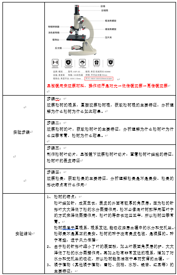

# 游戏开发原理实训项目总结


## 一、项目说明

用Unity实现虚拟仿真实验，实现线上实验功能

### 1、实验一：观察松树的根叶果




| 实验名称 |                       观察松树的根叶果                       |
| :------: | :----------------------------------------------------------: |
| 目的要求 | 1.  掌握以松树为代表的裸子植物主要特征。 2.了解松能生长在干旱贫瘠的陆地上的原因。 3. 掌握以松树为代表的裸子植物主要特征。4. 了解裸子植物与人类的关系。 |
| 材料用具 |           松树根 松树叶 松果 载玻片 盖玻片 显微镜            |
| 实验步骤 | 步骤一： 观察松树的根系，直接观察松树根，获取松树根的主要特征，分析理解为什么松树为什么如此耐旱。 步骤二： 观察松树的叶，获取松树叶的主要特征，分析理解为什么松树叶为什么四季常青，松树为什么耐旱。 制作松树叶切片，显微镜下观察松树叶切片：查看松树叶细胞的特征，松树叶的表皮特征  步骤三： 观察松果：获取松果的主要特征，分析理解松果是不是果实，松果的形状特点有什么作用 |
| 实验结论 | 1、 松树的特点： 松叶细如针，成束生长，表皮的外面有较厚的角质层。因为松的针形叶大大降低了松的水分蒸腾作用，松不必像阔叶树那样用落叶子的方式来降低蒸腾作用，松叶的寿命长达四五年，所以松树四季常青。 松树根属于直根系，根系发达,能吸收深层土壤中的水分和无机盐。 松球果不是真正的果实。松树的种子没有果皮包被，是裸露的。种子有翅，适于风力传播 2、 由于松的针形叶缩小了叶的表面积，加上叶表面角质层的护，大大降低了松的水分蒸腾作用。再加上松有非常发达的根系，增加了对水分和无机盐的吸收，所以松树能生活在干旱而贫瘠的土壤。 3、 裸子植物（其他裸子植物：雪松、侧柏、水杉、银杏、红豆等）的主要特征： 根、茎、叶发达。 能产生种子，种子是裸露的。 适应干旱、贫瘠的陆地生活。 4、 裸子植物与人类的密切关系： 提供化工和医药产品 保持水土、防风固沙 提供优质木材 减少噪音，净化空气，绿化环境。 我国是“裸子植物故乡”，银杉、水杉、银杏等珍稀裸子植物为我国特有。 |
| 讨论要点 | 1、裸子植物的特征  2、松树常绿的原因  3、松树能生活在干旱、土壤贫瘠的地方的原因。  4、裸子植物种类最多的国家 |


---


## 二、场景切换的实现

[参考教程](https://blog.csdn.net/yaoning6768/article/details/88083530)

> 实验步骤
>
> 1. 创建多个场景，在各个场景中创建场景跳转按钮，设置按钮文字大小样式等
> 2. 点击左上角的File-Build Settings，点击add open Scene，添加创建的几个场景
> 3. 编写跳转控制代码，将代码设置到按钮上面，输入要跳转的场景名称
> 4. 运行，实现场景的跳转


场景跳转代码

```c#
using System.Collections;
using System.Collections.Generic;
using UnityEngine;
using UnityEngine.SceneManagement;
using UnityEngine.UI;

/*
 * 场景跳转控制器
 * 设置在按钮上，点击按钮跳转到SenceName场景
 */

public class SenceChooseController : MonoBehaviour
{
    //获取要跳转的场景名称
    public string senceName;
    void Start()
    {
        //获取按钮后设置按钮点击执行函数OnButtonClick
        this.GetComponent<Button>().onClick.AddListener(OnButtonClick);
    }
    
    //按钮点击执行函数
    void OnButtonClick()
    {
        //切换到SenceName场景
        SceneManager.LoadScene(senceName);
    }
}

```

演示效果


