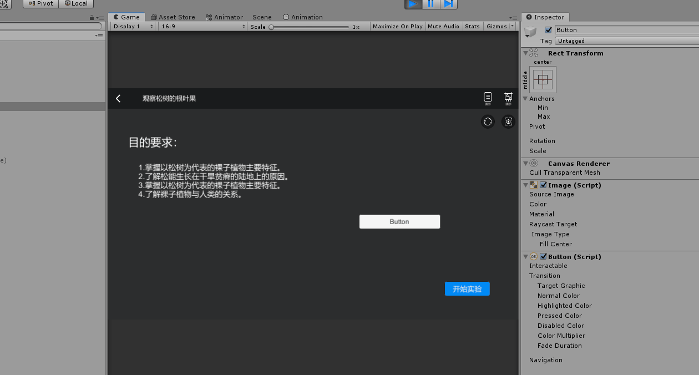

# 游戏开发原理实训项目总结


## 一、项目说明

用Unity实现虚拟仿真实验，实现线上实验功能

### 1、实验名称：观察松树的根叶果


---


## 二、场景切换的实现

[参考教程](https://blog.csdn.net/yaoning6768/article/details/88083530)

> 实验步骤
>
> 1. 创建多个场景，在各个场景中创建场景跳转按钮，设置按钮文字大小样式等
> 2. 点击左上角的File-Build Settings，点击add open Scene，添加创建的几个场景
> 3. 编写跳转控制代码，将代码设置到按钮上面，输入要跳转的场景名称
> 4. 运行，实现场景的跳转


场景跳转代码

```c#
using System.Collections;
using System.Collections.Generic;
using UnityEngine;
using UnityEngine.SceneManagement;
using UnityEngine.UI;

/*
 * 场景跳转控制器
 * 设置在按钮上，点击按钮跳转到SenceName场景
 */

public class SenceChooseController : MonoBehaviour
{
    //获取要跳转的场景名称
    public string senceName;
    void Start()
    {
        //获取按钮后设置按钮点击执行函数OnButtonClick
        this.GetComponent<Button>().onClick.AddListener(OnButtonClick);
    }
    
    //按钮点击执行函数
    void OnButtonClick()
    {
        //切换到SenceName场景
        SceneManager.LoadScene(senceName);
    }
}

```

演示效果


---


## 三、UI界面设计

### 1、UI界面自适应屏幕问题

- 将Canvas的Canvas Scaler组件中的UI Scale Mode改为Scale With Screen Size
- 修改Canvas的子控件布局，设置子控件相对于屏幕某个地方的相对位置

效果如下


## 2、UI动画设计

参考教程：[Unity 简单动画（帧动画，Animation，Tween）](https://www.jianshu.com/p/3677214564c9)


---

## 四、Unty简单动画效果

### 1、Unity加载Fbx模型及其动画

参考教程[百度经验](https://jingyan.baidu.com/article/63f23628c043b24209ab3d04.html)

### 2、添加脚本实现模型不停旋转效果

```c#
public int rotateSpeed = 0; //旋转速度，默认为0
this.transform.Rotate(Vector3.up * rotateSpeed); //绕上方轴旋转
```

实现效果：


### 3、使用leanTween脚本制作动画

1. 在Asset Store下载leanTween之后，导入到项目文件当中

2. 书写动画代码，附加到UI上面

   ```c#
   //3个参数1.变换的物体，2变化内容，3.时间
   LeanTween.scale(this.gameObject, new Vector3(1, 2, 1), 0.5f);
   LeanTween.rotate(this.gameObject, new Vector3(0, 90, 90), 0.5f);
   LeanTween.move(this.gameObject, new Vector3(0, 2, 2), 0.5f);
   ```

   实现效果




----


## 五、摄像头控制

代码控制摄像头移动旋转缩放

```c#

    //移动旋转缩放速度
    public float translateSpeed = 5.0f;
    public float rotateSpeed = 5.0f;
    public float zoomSpeed = 0.5f；

    private void cameraRotate() //摄像机右键旋转
    {
       
        var mouse_x = Input.GetAxis("Mouse X");//获取鼠标X轴移动
        var mouse_y = -Input.GetAxis("Mouse Y");//获取鼠标Y轴移动
      
        if (Input.GetKey(KeyCode.Mouse2))
        {
            transform.Translate(Vector3.left * (mouse_x * rotateSpeed) * Time.deltaTime);
            transform.Translate(Vector3.up * (mouse_y * rotateSpeed) * Time.deltaTime);
        }
    }

    private void cameraTranslate() //摄像机中键平移
    {
        var mouse_x = Input.GetAxis("Mouse X");//获取鼠标X轴移动
        var mouse_y = -Input.GetAxis("Mouse Y");//获取鼠标Y轴移动

        if (Input.GetKey(KeyCode.Mouse1))
        {
            transform.RotateAround(new Vector3(0,0,0), Vector3.up, mouse_x * translateSpeed);
            transform.RotateAround(new Vector3(0, 0, 0), transform.right, mouse_y * translateSpeed);
        }
    }

    private void cameraZoom() //摄像机滚轮缩放
    {
        if (Input.GetAxis("Mouse ScrollWheel") > 0)
            transform.Translate(Vector3.forward * zoomSpeed);


        if (Input.GetAxis("Mouse ScrollWheel") < 0)
            transform.Translate(Vector3.forward * -1 * zoomSpeed);
    }
```


实现效果


---

## 六、Unity中物体的属性设置

### 1、在某个位置创建物体

```c#
Instantiate(gameObject, position, gameobject.transform.rotation); 
```

